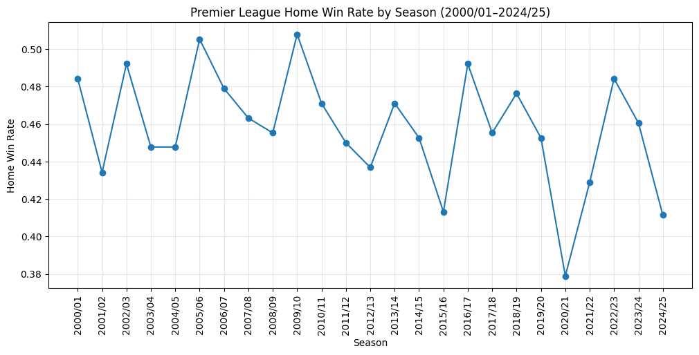

# EPL Data Analysis

Exploratory data analysis of 25 seasons of Premier League match data.

## Key Findings

- Home advantage has declined over 25 seasons — home win rate dropped 
  from ~48% (2000/01) to ~41% (2024/25), with away win rate rising 
  from 25% to ~34% over the same span.
- The traditional "Big Six" clubs hold a clear home-advantage edge: 
  Man United, Arsenal, Liverpool, Man City, Chelsea, and Tottenham 
  all have home win rates above 58%, even after filtering out teams 
  with small sample sizes.
- Scoring has trended upward over time, from ~2.61 goals/match in 
  2000/01 to ~2.97 in 2024/25, with a notable spike to ~3.28 
  goals/match in 2023/24, the highest of the dataset.

## How to run

1. Clone this repo
2. `pip install pandas matplotlib`
3. Open `epl_eda.ipynb` in Jupyter or upload to Google Colab
4. Run all cells (data file: `epl_final.csv`, included in this repo)

## Data

25 seasons (2000/01–2024/25) of Premier League match results, 
sourced from [Kaggle](https://www.kaggle.com/datasets/marcohuiii/english-premier-league-epl-match-data-2000-2025).
